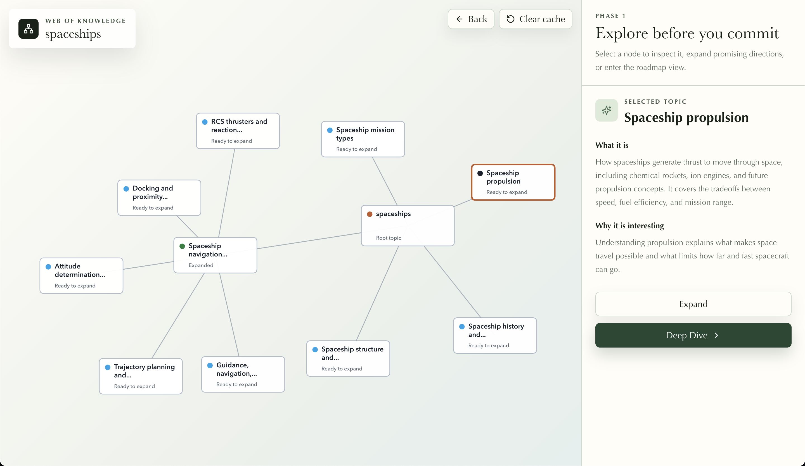
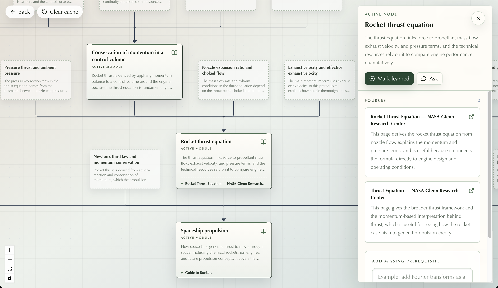

# Leaf Learning

Leaf Learning is an AI-powered exploration tool that won Best Presentation Award at the [2026 ALPHAG3N Human-centered AI Hackathon](https://www.alphag3n.com/copy-of-stanford-hack-a-thon-2025) hosted at Stanford University. It helps learners turn a vague curiosity into a concrete learning path by combining interactive knowledge graphs with personalized prerequisite trees.

[[Website](https://leaf-learning.onrender.com)]
[[Slideshow](https://docs.google.com/presentation/d/1O70yJyQQsI6SDCcgTr-VmOmwUYT0BXM5DgHIcuE9isM/edit?usp=sharing)]
[[Writeup](https://docs.google.com/document/d/16RewLLMIMhGDrjEX0XKtfAtOPtV-31ZVWJKKyrUm_B8/edit?usp=sharing)]

## Overview

People often want to learn something new but do not yet know the shape of the field, what related ideas exist, or which fundamentals they need first. Leaf Learning addresses that gap by acting as a learner-directed guide from initial curiosity to actionable next steps.

The experience has two phases:

### Phase 1: Concept Exploration

Starting from a broad prompt, Leaf generates an interactive concept map of related ideas, disciplines, and connections. Learners can expand nodes, explore adjacent topics, and narrow in on an area they want to understand more deeply.

### Phase 2: Learning Path Building

Once a learner chooses a topic, Leaf generates a prerequisite tree with foundational concepts, skills, and resources. Learners can prune, edit, expand, and personalize the tree based on what they already know and what they still need to learn.

## Human-Centered AI

Leaf uses AI to support open-ended exploration across an unbounded space of learner interests, but keeps the learner in control. Users decide what to explore, what to ignore, how deep to go, and which resources to follow. The goal is not to replace curiosity with automation, but to help learners navigate unknown unknowns and start learning with more confidence.

## Repository Structure

- `frontend/` - React and TypeScript interface for the graph-based learning experience.
- `backend/` - FastAPI backend with AI generation, session handling, graph data, and resource validation.
